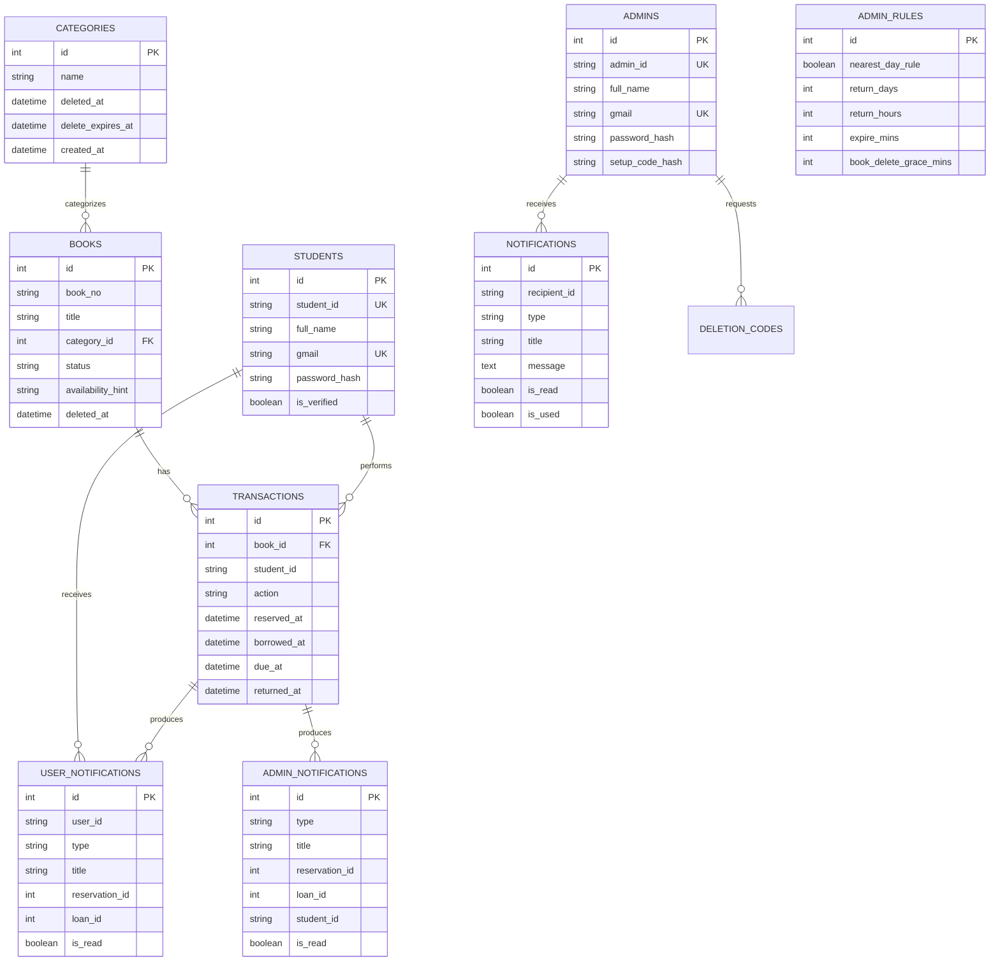

# 04 — Database Analysis

## 4.1 Database Engine

- ✅ [VERIFIED FROM: src/core/db.py:1-16] The application uses MySQL through `mysql.connector`.
- ✅ [VERIFIED FROM: src/core/db.py:8-15] Connection configuration is loaded from `DB_HOST`, `DB_USER`, `DB_PASSWORD`, `DB_NAME`, and `DB_PORT`, defaulting to `localhost/root/(blank)/click_and_collect/3306`.
- ✅ [VERIFIED FROM: src/core/db.py:18-22; app.py:73] Connections are stored per Flask request in `g.db` and closed through `app.teardown_appcontext(close_db)`.
- ✅ [VERIFIED FROM: app.py:92-102; src/core/models.py:50-255] Schema bootstrap runs before request handling via `initialize_schema()`.

## 4.2 Table Inventory

| Table Name | Primary Key | Description | Evidence |
|---|---|---|---|
| `students` | `id` | Core or dynamic table used by LBAS features | ✅ [VERIFIED FROM: src/core/models.py:50-255 and dynamic `_ensure_*` functions] |
| `admins` | `id` | Core or dynamic table used by LBAS features | ✅ [VERIFIED FROM: src/core/models.py:50-255 and dynamic `_ensure_*` functions] |
| `categories` | `id` | Core or dynamic table used by LBAS features | ✅ [VERIFIED FROM: src/core/models.py:50-255 and dynamic `_ensure_*` functions] |
| `books` | `id` | Core or dynamic table used by LBAS features | ✅ [VERIFIED FROM: src/core/models.py:50-255 and dynamic `_ensure_*` functions] |
| `transactions` | `id` | Core or dynamic table used by LBAS features | ✅ [VERIFIED FROM: src/core/models.py:50-255 and dynamic `_ensure_*` functions] |
| `pending_confirmations` | `id` | Core or dynamic table used by LBAS features | ✅ [VERIFIED FROM: src/core/models.py:50-255 and dynamic `_ensure_*` functions] |
| `recovery_codes` | `id` | Core or dynamic table used by LBAS features | ✅ [VERIFIED FROM: src/core/models.py:50-255 and dynamic `_ensure_*` functions] |
| `security_logs` | `id` | Core or dynamic table used by LBAS features | ✅ [VERIFIED FROM: src/core/models.py:50-255 and dynamic `_ensure_*` functions] |
| `notifications` | `id` | Core or dynamic table used by LBAS features | ✅ [VERIFIED FROM: src/core/models.py:50-255 and dynamic `_ensure_*` functions] |
| `user_notifications` | `id` | Core or dynamic table used by LBAS features | ✅ [VERIFIED FROM: src/core/models.py:50-255 and dynamic `_ensure_*` functions] |
| `admin_notifications` | `id` | Core or dynamic table used by LBAS features | ✅ [VERIFIED FROM: src/core/models.py:50-255 and dynamic `_ensure_*` functions] |
| `ip_token_buckets` | `id` | Core or dynamic table used by LBAS features | ✅ [VERIFIED FROM: src/core/models.py:50-255 and dynamic `_ensure_*` functions] |
| `system_load_snapshots` | `id` | Core or dynamic table used by LBAS features | ✅ [VERIFIED FROM: src/core/models.py:50-255 and dynamic `_ensure_*` functions] |
| `admin_rules` | `id` | Core or dynamic table used by LBAS features | ✅ [VERIFIED FROM: src/core/models.py:50-255 and dynamic `_ensure_*` functions] |
| `deletion_codes` | `id` | Core or dynamic table used by LBAS features | ✅ [VERIFIED FROM: src/core/models.py:50-255 and dynamic `_ensure_*` functions] |
| `courses` | `id` | Core or dynamic table used by LBAS features | ✅ [VERIFIED FROM: src/core/models.py:50-255 and dynamic `_ensure_*` functions] |
| `admin_logs` | `id` | Core or dynamic table used by LBAS features | ✅ [VERIFIED FROM: src/core/models.py:50-255 and dynamic `_ensure_*` functions] |

## 4.3 Per-Table Field Analysis

### Table: `students`

| Field Name | Data Type | Nullable | Default | Key | Description |
|---|---|---|---|---|---|
| id | INT | NO | AUTO_INCREMENT | PK | Internal numeric primary key |
| student_id | VARCHAR(40) | NO | none | UNIQUE | Student login/identity number |
| lbc_no | VARCHAR(40) | YES | NULL |  | Library card number |
| full_name | VARCHAR(160) | NO | none |  | Student full name |
| address | VARCHAR(255) | YES | NULL |  | Postal/home address |
| contact_no | VARCHAR(40) | YES | NULL |  | Phone contact used for SMS |
| password_hash | VARCHAR(255) | NO | none |  | bcrypt hash |
| course | VARCHAR(120) | YES | NULL |  | Course; N/A for JHS |
| year_level | VARCHAR(40) | YES | NULL |  | Year/grade level |
| gmail | VARCHAR(255) | NO | none | UNIQUE | Gmail account |
| is_verified | TINYINT(1) | YES | 0 |  | Verified/approved flag |
| account_type | VARCHAR(20) | YES | student |  | Role marker |
| last_login_ip | VARCHAR(80) | YES | NULL |  | Last login IP |
| last_login_time | DATETIME | YES | NULL |  | Last login time |
| deleted_at | DATETIME | YES | NULL |  | Soft delete timestamp |
| deleted_by | VARCHAR(40) | YES | NULL |  | Admin/system that deleted |
| last_active | DATETIME | YES | CURRENT_TIMESTAMP |  | Activity timestamp |
| created_at | DATETIME | YES | CURRENT_TIMESTAMP |  | Creation timestamp |
| account_gen_no | INT | YES | 1 |  | Digital-card generation number added dynamically |
| account_state | VARCHAR(20) | YES | active |  | Pending/active/suspended/rejected dynamic state |
| suspended_at | DATETIME | YES | NULL |  | Suspension timestamp |
| suspended_by | VARCHAR(40) | YES | NULL |  | Suspending admin |

### Table: `admins`

| Field Name | Data Type | Nullable | Default | Key | Description |
|---|---|---|---|---|---|
| id | INT | NO | AUTO_INCREMENT | PK | Internal numeric primary key |
| admin_id | VARCHAR(40) | NO | none | UNIQUE | Admin login/identity number |
| lbc_no | VARCHAR(40) | YES | NULL |  | Library card number |
| full_name | VARCHAR(160) | NO | none |  | Admin full name |
| address | VARCHAR(255) | YES | NULL |  | Address |
| contact_no | VARCHAR(40) | YES | NULL |  | Contact number |
| password_hash | VARCHAR(255) | NO | none |  | bcrypt hash |
| gmail | VARCHAR(255) | NO | none | UNIQUE | Gmail address |
| is_verified | TINYINT(1) | YES | 0 |  | Email/activation flag |
| setup_code_hash | VARCHAR(255) | YES | NULL |  | bcrypt hash of one-time admin setup code |
| last_login_ip | VARCHAR(80) | YES | NULL |  | Last login IP |
| last_login_time | DATETIME | YES | NULL |  | Last login time |
| deleted_at | DATETIME | YES | NULL |  | Soft delete timestamp |
| deleted_by | VARCHAR(40) | YES | NULL |  | Deleting admin |
| last_active | DATETIME | YES | CURRENT_TIMESTAMP |  | Activity timestamp |
| created_at | DATETIME | YES | CURRENT_TIMESTAMP |  | Creation timestamp |

### Table: `categories`

| Field Name | Data Type | Nullable | Default | Key | Description |
|---|---|---|---|---|---|
| id | INT | NO | AUTO_INCREMENT | PK | Category key |
| name | VARCHAR(120) | NO | none | UNIQUE | Category name |
| deleted_at | DATETIME | YES | NULL |  | Soft delete timestamp |
| delete_expires_at | DATETIME | YES | NULL |  | Undo-window expiry |
| created_at | DATETIME | YES | CURRENT_TIMESTAMP |  | Creation timestamp |

### Table: `books`

| Field Name | Data Type | Nullable | Default | Key | Description |
|---|---|---|---|---|---|
| id | INT | NO | AUTO_INCREMENT | PK | Book row key |
| book_no | VARCHAR(60) | NO | none | UNIQUE(book_no,category_id) | Book number |
| title | VARCHAR(255) | NO | none |  | Book title |
| author | VARCHAR(160) | YES | NULL |  | Dynamic author column in books API |
| category_id | INT | YES | NULL | FK | References categories.id |
| status | VARCHAR(40) | YES | Available |  | Stored status |
| reserved_count | INT | YES | 0 |  | Reservation counter |
| borrowed_count | INT | YES | 0 |  | Borrow counter legacy |
| borrow_count | INT | YES | 0 |  | Borrow counter used for sorting |
| reserve_count | INT | YES | 0 |  | Reservation counter alternate |
| availability_hint | VARCHAR(20) | YES | Available |  | Effective availability hint |
| deleted_at | DATETIME | YES | NULL |  | Soft delete timestamp |
| delete_expires_at | DATETIME | YES | NULL |  | Undo-window expiry |
| created_at | DATETIME | YES | CURRENT_TIMESTAMP |  | Creation timestamp |

### Table: `transactions`

| Field Name | Data Type | Nullable | Default | Key | Description |
|---|---|---|---|---|---|
| id | INT | NO | AUTO_INCREMENT | PK | Transaction key |
| book_id | INT | NO | none | FK | References books.id |
| book_no | VARCHAR(60/20) | NO | none |  | Book number snapshot |
| student_id | VARCHAR(40) | NO | none |  | Borrower/reserver ID |
| action | VARCHAR(20) | NO | none |  | reserved/borrowed/returned/cancelled/force_returned |
| actor_admin_id | VARCHAR(40) | YES | NULL |  | Admin actor |
| reserved_at | DATETIME | YES | NULL |  | Reservation timestamp |
| pickup_at | DATETIME | YES | NULL |  | Pickup date |
| borrowed_at | DATETIME | YES | NULL |  | Borrow timestamp |
| due_at | DATETIME | YES | NULL |  | Due deadline |
| expected_return_at | DATETIME | YES | NULL |  | Expected return date |
| queue_position | INT | YES | NULL |  | Reservation queue rank |
| returned_at | DATETIME | YES | NULL |  | Completion/cancel timestamp |
| ready_sms_sent_at | DATETIME | YES | NULL |  | Ready SMS sent marker |
| overdue_sms_sent_at | DATETIME | YES | NULL |  | Overdue SMS sent marker |
| notes | TEXT | YES | NULL |  | Notes/reason |
| created_at | DATETIME | YES | CURRENT_TIMESTAMP |  | Record creation |

### Table: `pending_confirmations`

| Field Name | Data Type | Nullable | Default | Key | Description |
|---|---|---|---|---|---|
| id | INT | NO | AUTO_INCREMENT | PK | Confirmation key |
| token | VARCHAR(255) | NO | none | UNIQUE | Email token |
| gmail | VARCHAR(255) | NO | none |  | Gmail being confirmed |
| confirmed | TINYINT(1) | YES | 0 |  | Confirmed flag |
| type | VARCHAR(20) | YES | student |  | student/admin token type |
| setup_code_temp | VARCHAR(50) | YES | NULL |  | Temporary admin setup code |
| expires_at | DATETIME | NO | none |  | Token expiry |
| created_at | DATETIME | YES | CURRENT_TIMESTAMP |  | Creation timestamp |

### Table: `recovery_codes`

| Field Name | Data Type | Nullable | Default | Key | Description |
|---|---|---|---|---|---|
| id | INT | NO | AUTO_INCREMENT | PK | Recovery key |
| student_id | VARCHAR(40) | NO | none |  | Account ID |
| code | VARCHAR(12) | NO | none |  | Email recovery code (stored plaintext) |
| used | TINYINT(1) | YES | 0 |  | Used flag |
| expires_at | DATETIME | NO | none |  | Expiry |
| created_at | DATETIME | YES | CURRENT_TIMESTAMP |  | Creation timestamp |

### Table: `security_logs`

| Field Name | Data Type | Nullable | Default | Key | Description |
|---|---|---|---|---|---|
| id | INT | NO | AUTO_INCREMENT | PK | Security log key |
| student_id | VARCHAR(40) | NO | none |  | Legacy account ID |
| account_id | VARCHAR(40) | YES | NULL |  | Dynamic account ID |
| account_type | VARCHAR(20) | YES | unknown |  | Role |
| event_type | VARCHAR(80) | NO | none |  | Event name |
| ip_address | VARCHAR(80) | YES | NULL |  | Client IP |
| description | VARCHAR(255) | YES | NULL |  | Description |
| created_at | DATETIME | YES | CURRENT_TIMESTAMP |  | Timestamp |

### Table: `notifications`

| Field Name | Data Type | Nullable | Default | Key | Description |
|---|---|---|---|---|---|
| id | INT | NO | AUTO_INCREMENT | PK | Notification key |
| recipient_id | VARCHAR(40) | NO | none |  | Admin/student recipient ID |
| type | VARCHAR(50) | NO | none |  | Type |
| notification_type | VARCHAR(50) | YES | general |  | Display type |
| title | VARCHAR(120) | NO | none |  | Title |
| message | TEXT | YES | NULL |  | Body |
| data | TEXT | YES | NULL |  | JSON text payload |
| is_read | TINYINT(1) | YES | 0 |  | Read flag |
| is_used | TINYINT(1) | YES | 0 |  | Consumed code/action flag |
| created_at | DATETIME | YES | CURRENT_TIMESTAMP |  | Creation timestamp |

### Table: `user_notifications`

| Field Name | Data Type | Nullable | Default | Key | Description |
|---|---|---|---|---|---|
| id | INT | NO | AUTO_INCREMENT | PK | Student notification key |
| user_id | VARCHAR(40) | NO | none |  | Student recipient |
| type | VARCHAR(60) | NO | none |  | Type |
| title | VARCHAR(120) | NO | none |  | Title |
| message | TEXT | NO | none |  | Body |
| reservation_id | INT | YES | NULL |  | Reservation link |
| loan_id | INT | YES | NULL |  | Loan link |
| book_id | INT | YES | NULL |  | Book link |
| is_read | TINYINT(1) | YES | 0 |  | Read flag |
| created_at | DATETIME | YES | CURRENT_TIMESTAMP |  | Creation timestamp |

### Table: `admin_notifications`

| Field Name | Data Type | Nullable | Default | Key | Description |
|---|---|---|---|---|---|
| id | INT | NO | AUTO_INCREMENT | PK | Admin notification key |
| type | VARCHAR(60) | NO | none |  | Type |
| title | VARCHAR(120) | NO | none |  | Title |
| message | TEXT | NO | none |  | Body |
| reservation_id | INT | YES | NULL |  | Reservation link |
| loan_id | INT | YES | NULL |  | Loan link |
| student_id | VARCHAR(40) | YES | NULL |  | Student link |
| book_id | INT | YES | NULL |  | Book link |
| is_read | TINYINT(1) | YES | 0 |  | Read flag |
| created_at | DATETIME | YES | CURRENT_TIMESTAMP |  | Creation timestamp |

### Table: `ip_token_buckets`

| Field Name | Data Type | Nullable | Default | Key | Description |
|---|---|---|---|---|---|
| id | INT | NO | AUTO_INCREMENT | PK | Bucket key |
| ip_address | VARCHAR(64) | NO | none | UNIQUE | Client IP |
| tokens | FLOAT | YES | 10.0 |  | Remaining tokens |
| max_tokens | FLOAT | YES | 10.0 |  | Maximum tokens |
| replenish_hours | FLOAT | YES | 1.0 |  | Replenish interval |
| last_replenish | DATETIME | YES | CURRENT_TIMESTAMP |  | Last refill |
| is_blocked | TINYINT(1) | YES | 0 |  | Blocked flag |
| blocked_until | DATETIME | YES | NULL |  | Block expiry |
| created_at | DATETIME | YES | CURRENT_TIMESTAMP |  | Created |
| updated_at | DATETIME | YES | CURRENT_TIMESTAMP ON UPDATE |  | Updated |

### Table: `system_load_snapshots`

| Field Name | Data Type | Nullable | Default | Key | Description |
|---|---|---|---|---|---|
| id | INT | NO | AUTO_INCREMENT | PK | Snapshot key |
| simultaneous_login_attempts | INT | YES | 0 |  | Login pressure |
| simultaneous_active_users | INT | YES | 0 |  | Active users |
| total_daily_users | INT | YES | 0 |  | Daily users |
| load_tier | VARCHAR(20) | YES | normal |  | normal/elevated/high |
| snapshot_date | DATE | NO | none | UNIQUE | Date |
| updated_at | DATETIME | YES | CURRENT_TIMESTAMP ON UPDATE |  | Update time |

### Table: `admin_rules`

| Field Name | Data Type | Nullable | Default | Key | Description |
|---|---|---|---|---|---|
| id | INT | NO | 1 | PK | Singleton rules row |
| nearest_day_rule | TINYINT(1) | YES | 1 |  | Skip Sunday pickup rule |
| return_days | INT | YES | NULL/0 |  | Return days |
| return_hours | INT | YES | NULL/0 |  | Return hours |
| expire_days | INT | YES | NULL/0 |  | Reservation expiry days |
| expire_hours | INT | YES | NULL/0 |  | Reservation expiry hours |
| expire_mins | INT | YES | 30 |  | Reservation expiry minutes |
| expiry_enabled | TINYINT(1) | YES | 0 |  | Account expiry flag |
| expiry_years | INT | YES | NULL |  | Account expiry years |
| inactive_enabled | TINYINT(1) | YES | 0 |  | Inactive-account rule flag |
| inactive_days | INT | YES | NULL |  | Inactive days |
| warn_enabled | TINYINT(1) | YES | 0 |  | Warning flag |
| warn_before_days | INT | YES | 30 |  | Warning lead time |
| book_delete_grace_mins | INT | YES | 20 |  | Undo window for deleted books/categories |
| updated_at | DATETIME | YES | CURRENT_TIMESTAMP ON UPDATE |  | Updated |

### Table: `deletion_codes`

| Field Name | Data Type | Nullable | Default | Key | Description |
|---|---|---|---|---|---|
| id | INT | NO | AUTO_INCREMENT | PK | Deletion code key |
| requested_by | VARCHAR(40) | NO | none |  | Requester admin |
| target_id | VARCHAR(40) | NO | none |  | Target account |
| target_type | VARCHAR(10) | NO | none |  | admin/student |
| code | VARCHAR(10) | NO | none |  | Email-confirmed deletion code (stored plaintext) |
| confirmed_email | TINYINT(1) | YES | 0 |  | Target confirmed email |
| expires_at | DATETIME | NO | none |  | Expiry |
| used | TINYINT(1) | YES | 0 |  | Used flag |
| created_at | DATETIME | YES | CURRENT_TIMESTAMP |  | Created |

### Table: `courses`

| Field Name | Data Type | Nullable | Default | Key | Description |
|---|---|---|---|---|---|
| id | INT | NO | AUTO_INCREMENT | PK | Course key |
| name | VARCHAR(120) | NO | none | UNIQUE | Course name |
| created_at | DATETIME | YES | CURRENT_TIMESTAMP |  | Created |

### Table: `admin_logs`

| Field Name | Data Type | Nullable | Default | Key | Description |
|---|---|---|---|---|---|
| id | INT | NO | AUTO_INCREMENT | PK | Admin log key |
| student_id | VARCHAR(40) | YES | NULL |  | Related account |
| direction | VARCHAR(20) | YES | NULL |  | Direction |
| action | VARCHAR(120) | YES | NULL |  | Action |
| created_at | DATETIME | YES | CURRENT_TIMESTAMP |  | Created |

## 4.4 Relationships

| Parent Table | Child Table | Foreign Key | Relationship Type |
|---|---|---|---|
| `categories` | `books` | `books.category_id -> categories.id` | One category has many books. |
| `books` | `transactions` | `transactions.book_id -> books.id` | One book has many transaction records. |
| `students` | `transactions` | `transactions.student_id -> students.student_id` | One student has many transactions (not enforced by FK in DDL). |
| `students` | `user_notifications` | `user_notifications.user_id -> students.student_id` | One student has many user notifications (logical). |
| `students/admins` | `notifications` | `notifications.recipient_id -> account id` | One account has many generic notifications (logical). |
| `admins` | `deletion_codes` | `deletion_codes.requested_by/target_id -> admins.admin_id` | Admin deletion request workflow (logical). |
| `transactions` | `user_notifications` | `reservation_id/loan_id -> transactions.id` | A transaction may create many notifications (logical). |
| `transactions` | `admin_notifications` | `reservation_id/loan_id -> transactions.id` | A transaction may create many admin notifications (logical). |

## 4.5 Textual ERD

- `categories` has many `books` through `books.category_id`. ✅ [VERIFIED FROM: src/core/models.py:99-119]
- `books` has many `transactions` through `transactions.book_id`. ✅ [VERIFIED FROM: src/core/models.py:122-142]
- `students` logically has many `transactions` through `transactions.student_id`; the code joins these fields but does not define a foreign-key constraint. ✅ [VERIFIED FROM: src/api/transactions.py:394-400]
- `students` receives `user_notifications` through `user_notifications.user_id`. ✅ [VERIFIED FROM: src/api/transactions.py:305-322]
- `admins` receive generic `notifications` via `recipient_id`. ✅ [VERIFIED FROM: src/api/transactions.py:207-238]
- `deletion_codes` coordinates admin deletion with `requested_by` and `target_id`. ✅ [VERIFIED FROM: src/api/admin.py:349-418]

## 4.6 Mermaid ERD

