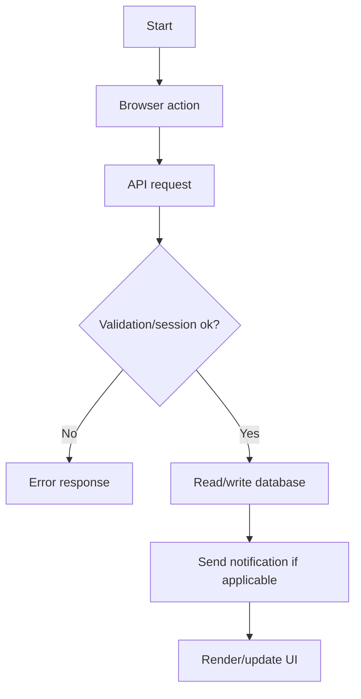
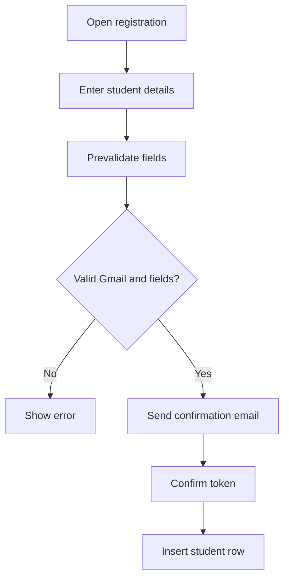
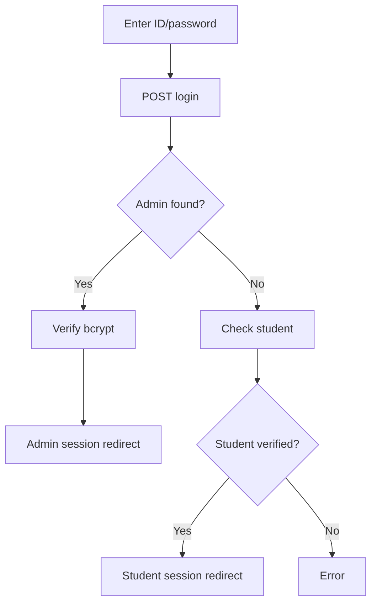
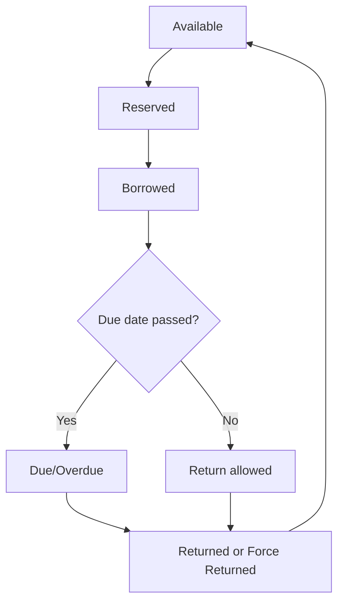
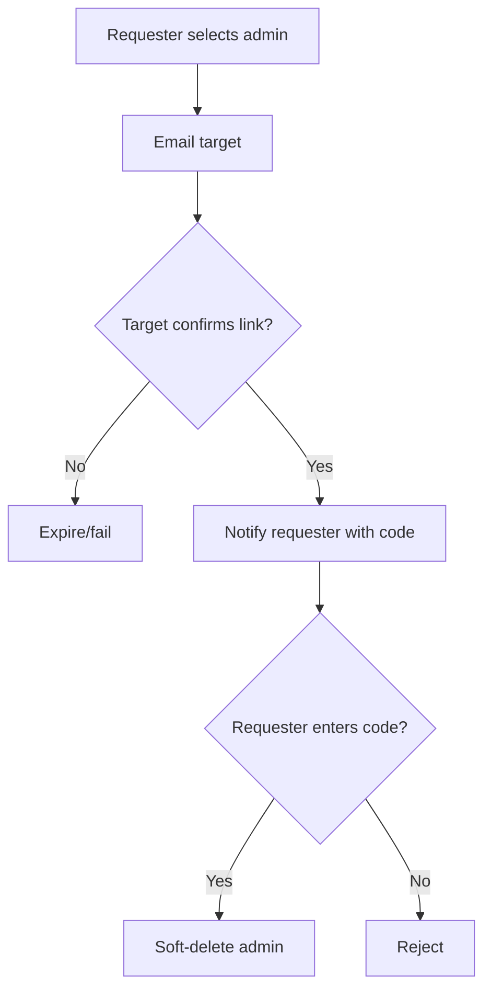
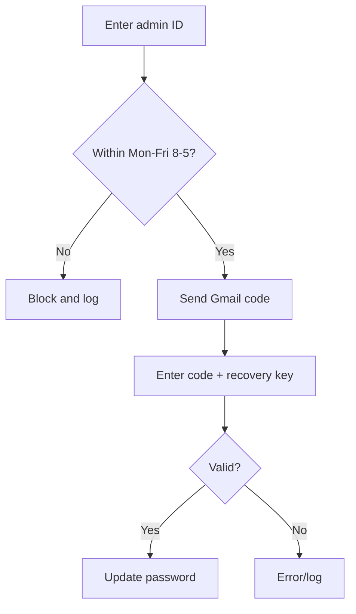

# 09 — Flowcharts (Mermaid)

✅ [VERIFIED FROM: `_docs/06_api_analysis.md` and `_docs/07_ipo_analysis.md`] These diagrams map documented code paths.

## Overall System Flowchart

## Student Registration Flowchart

## Student Login Flowchart

## Admin Login Flowchart

## Book Reservation Flowchart

## Full Book Lifecycle

## Admin Approval Flowchart

## Cancellation Flowchart

## Notification System Flowchart

## Admin Account Deletion Flowchart

## Digital Library Card + Print Flowchart

## Bulk Import Flowchart

## Account Recovery Flowchart (Student)

## Account Recovery Flowchart (Admin, time-window restricted)

