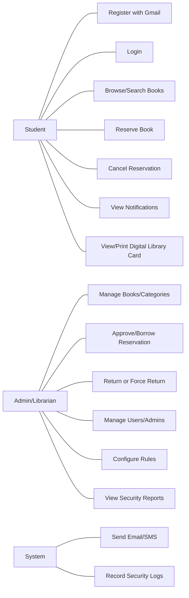
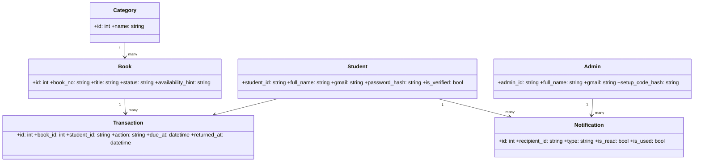
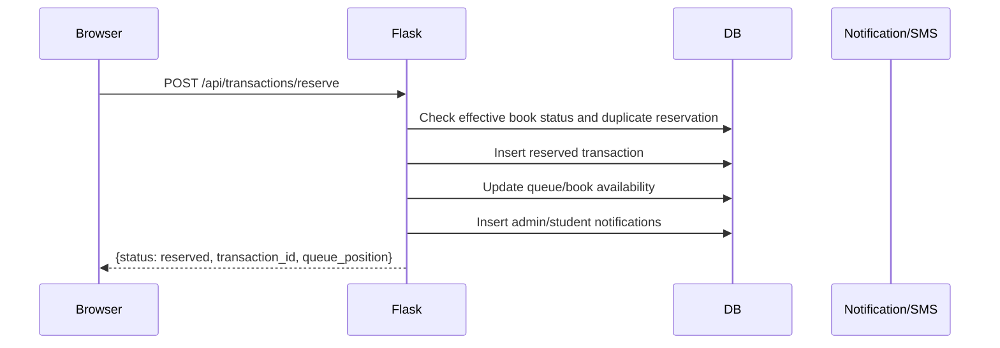
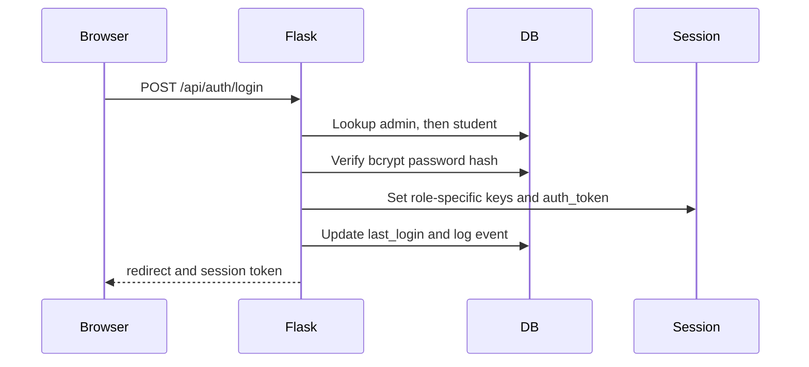
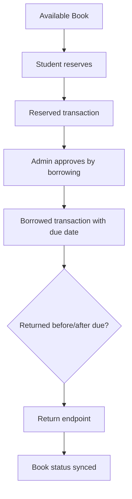
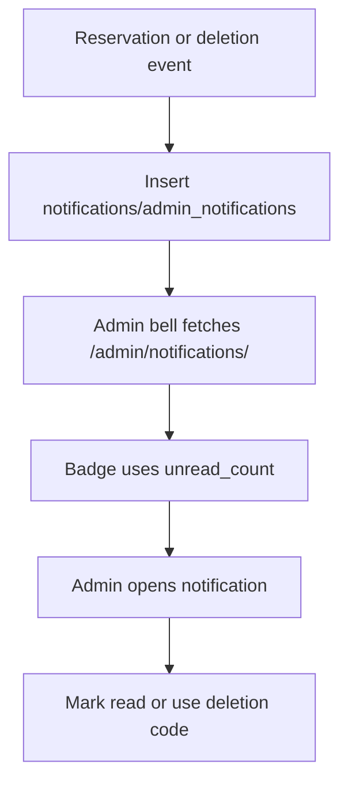

# 10 — UML Diagrams (Mermaid)

## 10.1 Use Case Diagram

## 10.2 Class Diagram

## 10.3 Sequence Diagram — Book Reservation

## 10.4 Sequence Diagram — Login

## 10.5 Activity Diagram — Full Borrow Lifecycle

## 10.6 Activity Diagram — Admin Notification Flow

✅ [VERIFIED FROM: src/core/models.py:7-45; src/api/transactions.py:250-440; src/api/auth.py:1950-2126; scripts/admin/shared_init.js:130-226]
